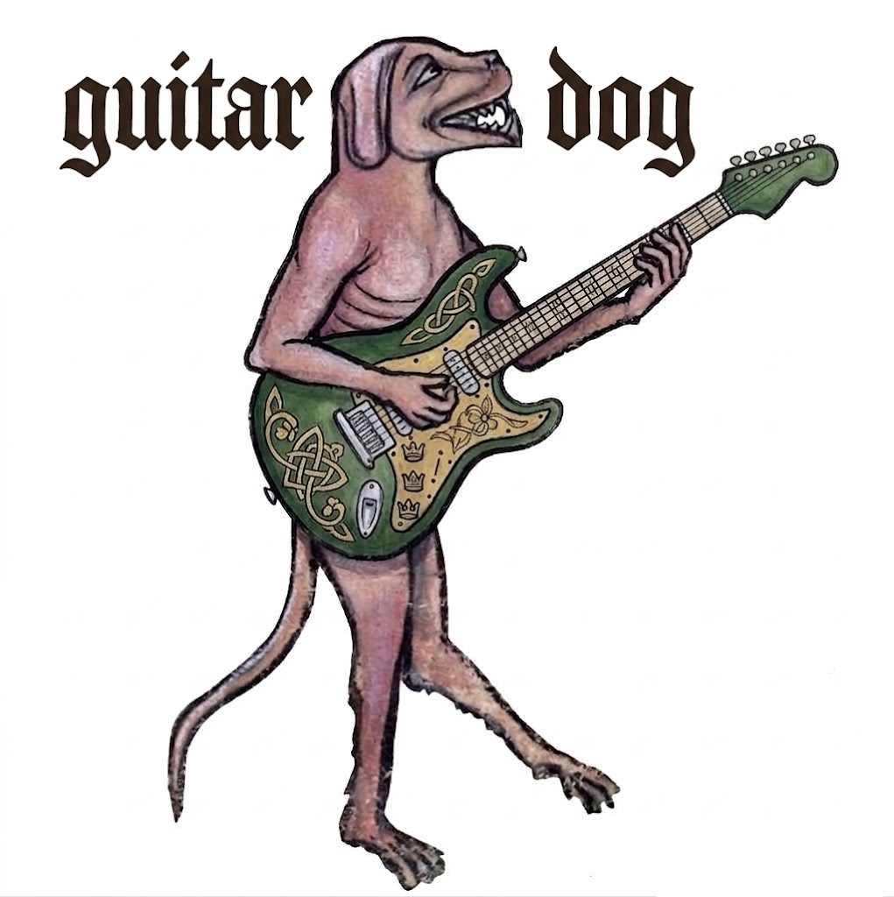
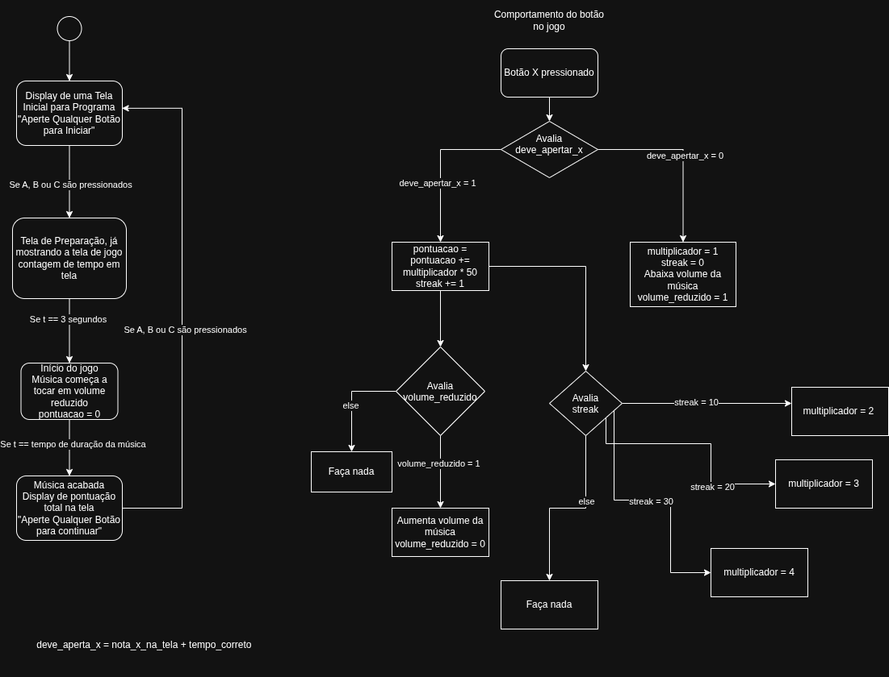

# Guitar Dog 
## O Guitar Hero do BitDogLab

Adaptação do jogo Guitar Hero para a placa BitDogLab V7 (RP2040), em MicroPython. Usa o display OLED para servir de tela do jogo e utiliza os botões A, B e C para fins de jogabilidade. A quantidade de cordas do jogo foi reduzida para três justamente para o uso dos três botões disponíveis na placa. Projeto da disciplina EA801 - Laboratório de Projeto de Sistemas Embarcados (FEEC/Unicamp).

## Etapa Inicial de trabalho

Como etapa inicial de nosso trabalho, a fim termos uma melhor visão mental dos requisitos do projeto Guitar Dog e assim facilitar o início de nossa etapa de programação, desenvolvemos uma conceptualização inicial do projeto através da elaboração de um primeiro diagrama de blocos que caracteriza-se o funcionamento padrão do famoso jogo Guitar Hero de forma que pudesse ser incorporado à nossa placa. 

Considerando as recomendações docentes, optamos por desconsiderar a adaptação de funcionalidades musicais e sonoras para essa versão inicial do projeto de forma que essas partes associadas foram deixadas de lado no momento. O sistema de pontuação também foi simplificado, desconsiderando-se o efeito de multiplicadores e, no lugar, apenas registrando acertos como indicando um ganho de 10 pontos.

Através do diagrama desenvolvemos a conceptualização do Guitar Dog como, fundamentalmente, uma máquina de estados finitos constituída por quatro diferentes estados:
- Tela de Início
- Tela de Load
- Tela de Jogo (com funções de jogabilidade associadas)
- Tela de Pontuação

Assim, abandonamos temporariamente o conceito de diferentes estágios ou níveis. Garantimos a rejogabilidade fazendo com que, após a tela de pontuação, retorne-se novamente à tela inicial.

### Demonstração do Guitar Dog em funcionamento
[Assista à demonstração do projeto](https://youtube.com/shorts/ToGgFWhk9B0?feature=share)
