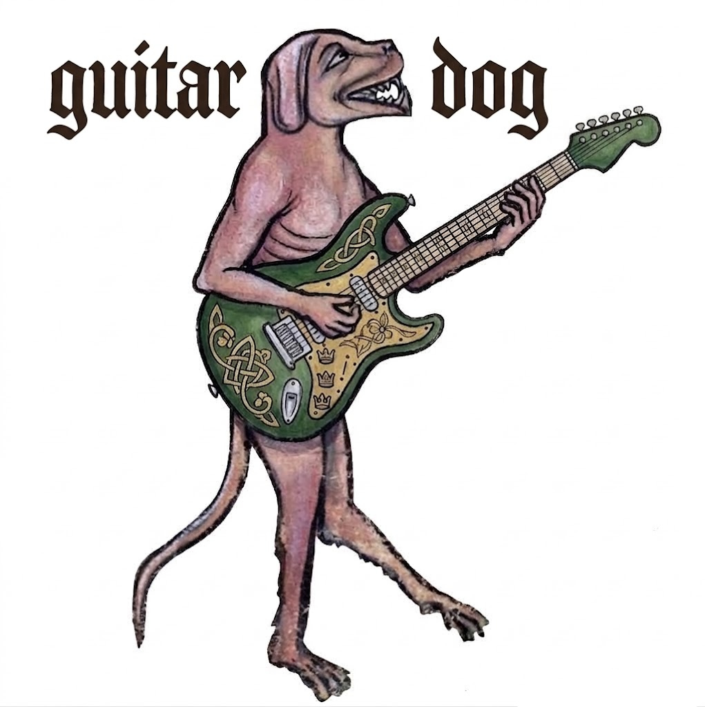
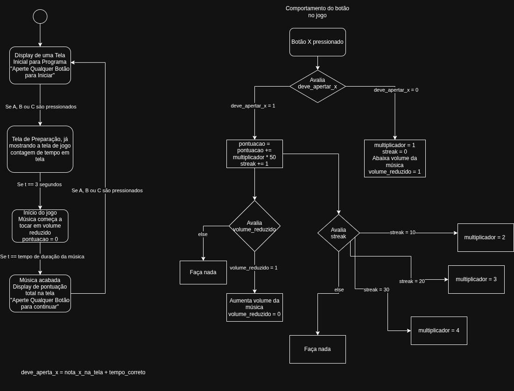

# Guitar Dog 
## O Guitar Hero do BitDogLab

Adaptação do jogo Guitar Hero para a placa BitDogLab V7 (RP2040), em MicroPython. Usa o display OLED para servir de tela do jogo e utiliza os botões A, B e C para fins de jogabilidade. A quantidade de cordas do jogo foi reduzida para três justamente para o uso dos três botões disponíveis na placa. Projeto da disciplina EA801 - Laboratório de Projeto de Sistemas Embarcados (FEEC/Unicamp).

## Etapa Inicial de trabalho

Como etapa inicial de nosso trabalho, a fim termos uma melhor visão mental dos requisitos do projeto Guitar Dog e, assim, facilitar e orientar o início de nossa etapa de programação, desenvolvemos uma conceptualização inicial do projeto através da elaboração de um primeiro diagrama de blocos que caracterizasse o funcionamento padrão do famoso jogo Guitar Hero de forma que pudesse ser incorporado à nossa placa. 

Considerando as recomendações docentes, optamos por desconsiderar a adaptação de funcionalidades musicais e sonoras para essa versão inicial do projeto de forma que essas partes associadas foram deixadas de lado no momento. O sistema de pontuação também foi simplificado, desconsiderando-se o efeito de multiplicadores e, no lugar, apenas registrando acertos e os pontuando com um ganho de 10 pontos.

Através do diagrama desenvolvemos a conceptualização do Guitar Dog como, fundamentalmente, uma máquina de estados finitos constituída por quatro diferentes estados com suas respectivas funcionalidades:

### - Tela de Início
Deve ter capacidade de identificar quando é pressionado qualquer dos três botões para garantir transição de estado. Display de tela informando nome do jogo de instruindo o jogador.

### - Tela de Load
Estado temporário, a transição para o próximo estado tem como condicional apenas a passagem do tempo. Display de contagem regressiva feita na tela, disponibiliza tempo para o jogador se preparar para o jogo e garante transição mais suave do que apenas abruptamente iniciar o jogo de imediato.

### - Tela de Jogo
Deve ter capacidade de "lançar" as telas graficamente na tela para display gráfico do jogo, atualizando a tela com o passar do tempo e fazendo as notas "descerem". Deve ser capaz de identificar quando um dos botões é pressionado e checar se ele foi apertado corretamente de acordo com a posição ou não da nota na "corda" correspondente. A um acerto são contabilizados 10 pontos. Abandonamos temporariamente o conceito de diferentes estágios ou níveis no jogo, desenvolvemos apenas uma única fase que é sempre a mesma.

### - Tela de Pontuação
Garantimos a rejogabilidade fazendo com que, após a tela de pontuação, retorne-se novamente à tela inicial. Esse estado, como o da tela de load, também vai ter transição associada a uma passagem temporal, após um tempo hábil para leitura da pontuação, retornamos à tela inicial.
### Demonstração de Resultado atual
[Assista à demonstração do projeto](https://youtube.com/shorts/ToGgFWhk9B0?feature=share)

### - Descrição do código 
O software do projeto foi desenvolvido em MicroPython e estruturado para rodar no microcontrolador RP2040 presente na placa BitDogLab. O sistema integra a leitura de periféricos de entrada (botões), controle de saída gráfica (display OLED) e manipulação do sistema de arquivos para persistência de dados.
Abaixo, detalham-se os principais módulos e decisões arquiteturais do código:

1. Configuração de Hardware e Bibliotecas
Para a interação com os periféricos da placa, o projeto utiliza as bibliotecas nativas machine e utime, além do driver externo ssd1306 para o display.
Display OLED (128x64): Controlado via protocolo I2C (pinos físicos SDA = 2 e SCL = 3), utilizando a classe SoftI2C operando a uma frequência de 50 kHz.
Entradas (Botões A, B e C): Mapeados, respectivamente, nos pinos 5, 6 e 10. Foram configurados como entradas digitais com resistores de elevação (pull-up) internos ativados. Dessa forma, a lógica é invertida: o estado ocioso é alto (nível 1) e o acionamento é baixo (nível 0).

2. Máquina de Estados Finitos (MEF)
O fluxo principal do programa foi modelado utilizando uma Máquina de Estados Finitos com quatro estados bem definidos, controlados por um laço while True principal:
ESTADO_TELA_INICIAL: Aguarda a interação do usuário para iniciar.
ESTADO_LOADING: Realiza uma contagem regressiva gráfica de 5 segundos.
ESTADO_JOGO: Executa o motor principal do jogo, onde a temporização das notas e a leitura simultânea dos botões ocorrem.
ESTADO_PONTUACAO: Exibe a pontuação obtida na partida e compara com o recorde salvo.

3. Motor do Jogo e Temporização Não-Bloqueante
A principal complexidade do projeto reside na função rodada_jogo, responsável por animar a queda das "notas" musicais e validar o tempo de resposta do jogador. Para que o jogo fluísse sem interromper a leitura dos botões, optou-se por não utilizar atrasos com bloqueio (delays/sleeps) durante as rodadas.
Controle de Tempo em Ticks: O tempo é monitorado continuamente utilizando utime.ticks_ms(). O display e o avanço das notas só são atualizados quando a diferença de tempo atinge um limite predefinido de 350 milisegundos (INTERVALO_TICK_MS).
Matriz e Janela de Acerto: A trajetória das notas é quantificada em 14 posições (de -1 a 13). O jogador deve pressionar o botão quando a nota atinge a "janela de acerto" (posições 11 e 12).

4. Leitura de Entradas e Tratamento de Ruído (Debounce)
A leitura dos botões é feita inteiramente via técnica de Polling (varredura contínua no laço principal), sem uso de interrupções de hardware (IRQs). Para evitar falsos positivos gerados por ruído mecânico (bouncing), o sistema implementa duas estratégias distintas:
Debounce por tempo (Telas de Menu): Realiza a leitura do botão, aplica um sleep de 50 ms e verifica novamente o estado, garantindo que o sinal estabilizou.
Debounce Lógico (Durante o Jogo): A leitura constante monitora a borda de descida do sinal lógico (quando o botão transita de 1 para 0). Para evitar contagens múltiplas de um único clique, utilizam-se flags de travamento. Assim que uma nota é validada ou perdida, ela é marcada como "julgada" e não pontuará novamente, imunizando o sistema contra leituras prolongadas ou ruídos mecânicos durante a janela de acerto.

5. Interface Gráfica
O código possui um conjunto de funções auxiliares (ex: desenhar_tela_inicial, desenhar_base_guitarra) que encapsulam os comandos da biblioteca SSD1306. A tela do jogo foi construída combinando caracteres em posições fixas (oled.text) e formas geométricas (oled.fill_rect) para representar as cordas e os alvos. As notas em movimento são atualizadas sobrescrevendo blocos retangulares na tela, simulando o efeito de rolagem da pista.

6. Persistência de Dados (Sistema de Arquivos)
Para que o maior placar (recorde) não fosse perdido ao reiniciar a placa, o programa escreve e lê dados diretamente na memória Flash não-volátil do microcontrolador. As funções carregar_recorde() e salvar_recorde() utilizam a estrutura padrão do Python (open(), read(), write()) para manter um arquivo texto chamado recorde.txt, garantindo a retenção da pontuação máxima ao longo de diferentes sessões de uso.

